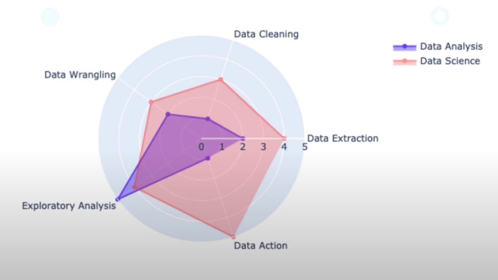

# data_analisys_cheatsheet

## What is?:

Wikipedia: Data analysis is a process of inspecting, cleansing, transforming and modeling data with the goal of discovering useful information, informing conclusions and supporting decision-making.

## Process

1. Getting the data:

   - SQL
   - Web Scrapping
   - File formats: CSV, JSON, XML
   - Consulting API
   - Buying Data
   - Distributed databases

2. Data Cleaning:

   - Missing values and empty data
   - Data imputation
   - Incorrect Types
   - Outliers correction
   - Statistical sanitation

3. Data Wrangling

   - Hieralchical Data
   - Handling Categorical Data
   - Reshaping and transforming structures
   - Indexing data for qick access
   - Merging, Convining and joining data.

4. Analisys

   - Exploration
   - Building statistical models
   - Visualitations and representation.
   - Correlation vs causation analisys.
   - Hypothesys testing.
   - Statistical analisys.
   - Reporting

5. Action

   - Building MAchine Learning Models
   - Feature Engeenering
   - Deploy
   - Building ETL pipelines
   - Live Dashboard and reporting
   - Desicion making and real life test.

## Data Analisys vs. Data Science:



## Libraries:

    - Pandas
    - Matplotlib
    - Numpy
    - Seaborn
    - Statsmodels
    - Scipy
    - Skit-learn

## Steps in a real project:

### Import libraries:

        #Imports
        import numpy as np
        import pandas as pd
        import matplotlib.pyplot as plt

### Import dataset

```python
# Read the file
dataset = pd.read_csv("datasets/netflix_titles.csv")
```

### Fast explore

```python
dataset.head()
dataset.shape
dataset.info()
dataset.describe()
```

## Kind of variables:

        - Numerical
        - Categorical

### Numerical Analysys and Visualitation

Usually we sellect some of the features to analise.
In the case of the Netflix dataset, we could start analizing the year of realease:

```python
dataset['release_year'].describe()
```

## Convert a variable to different data type

- Numeric to string:

```python
string_out = str (numeric_in)
```

- String to numeric:

```python
integer_out = int (string_in)
float_out = float (string_in)
```
